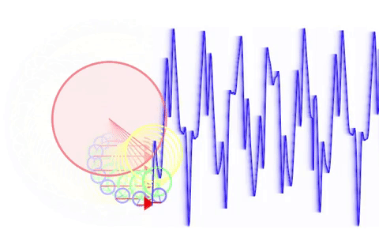

# Fourier Series

Visualizing the [Fourier series](https://en.wikipedia.org/wiki/Fourier_series) using Processing.

## Try it out!

Click the link below to try it yourself.

https://www.openprocessing.org/sketch/646562/embed/

### Controls

Move mouse left/right to change the frequency of the wave.

Move mouse up/down to change the shape of the wave.

## Result

  

 
